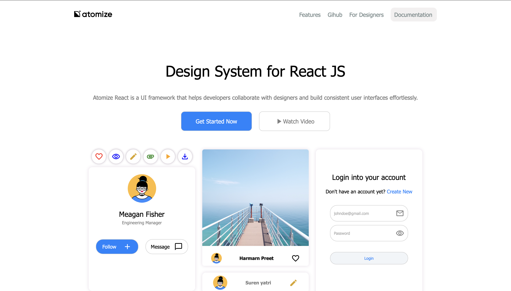
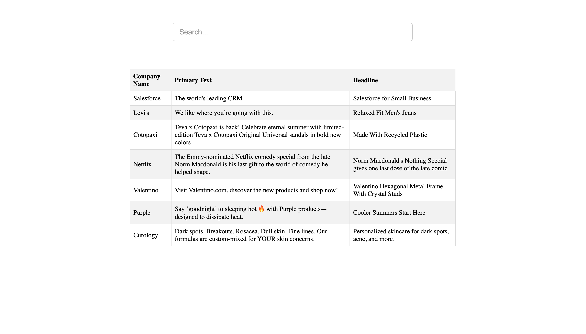

# 
Sanjeev Kumar Singh

  

Software Developer

  <a href="https://github.com/sanjeev567">GitHub</a> |
  <a href="https://linkedin.com/in/sanjeev-singh-8feb/">LinkedIn</a> |
  <a href="https://johndoe.com">Website</a>

---

## About Me

I am a passionate software developer with experience in various programming languages and technologies. I enjoy building innovative and efficient solutions to complex problems. My areas of expertise include:

- Frontend Development
- Backend Development
- Database Administrator

---

## Featured Projects

### Project 1

**E-Commerce shoping app using MERN stack**

- payment gateway integration
- jwt authentication
- password Hashing
- redux - cart state management and many more.

### Project 2

**Clone using react and sass | Try to make exact as atomize original site looks**

### Project 3

**Ad searching app**

- implement search across many collections of db using aggregate function.

## Skills

- Programming Languages: Python, JavaScript, Java, Cpp, C
- Web Dev Skills: HTML5, CSS3, Sass, Bootstrap, tailwind
- Frameworks and Libraries: React, Node, Express
- Databases: MySQL, MongoDB
- Version Control: Git, GitHub
- Soft Skill: Communication, Writing, Documentation

---

## Education

- Bachelor of Technology in Computer Science, Bakhtiyarpur College of Engineering (2023)

---

&copy; 2023 Sanjeev Kumar Singh

